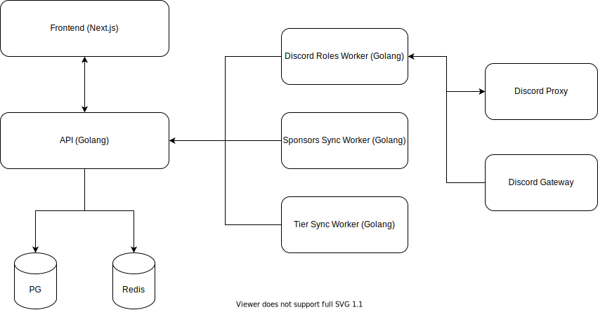

# Sponsor Roles Specification

## 📜 Proposal
A history of the proposal can be viewed in [`/proposals`](./proposals).

## 📚 Terminology
`creator` - the person being sponsored, referred to on Github as a Github Sponsor  
`sponsor` - the person sponsoring the creator

## ⚙ Infrastructure Model

## 💾 Data Sources

### Postgres (PG)
The database for the application.
### Redis
The cache-database for the application.

## 💪 Main Services

### Frontend (Next.js)
This is the frontend for the application. It's written in Typescript utilizing Next.js and React and will be hosted on Vercel.

### API (Golang)
This is the API for the application. It's written in Golang utilizing Fiber.

## 🔨 Workers

### Discord Roles Worker (Golang)
This worker will:
* intercept `GUILD_MEMBER_CREATE` packets and referencing the database to apply roles to that user if necessary

### Sponsors Sync Worker (Golang)
This worker will:
* periodically query the Github GraphQL API for a creator's sponsors to ensure they match our records
  * if a sponsor does not have roles applied and their tier has role application configured, those roles will be applied

### Tier Sync Worker (Golang)
This worker will:
* periodically query the Github GraphQL API for a creator's sponsorship tiers to ensure they match our records
  * if tiers with role application have been deleted, the creator will be alerted via Discord of the change